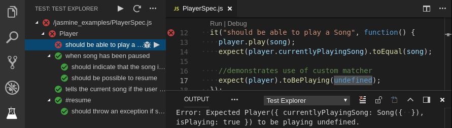

# Jasmine Test Explorer for Visual Studio Code

Run your Jasmine tests in Node using the 
[Test Explorer UI](https://marketplace.visualstudio.com/items?itemName=hbenl.vscode-test-explorer).



## Features
* Shows a Test Explorer in the Test view in VS Code's sidebar with all detected tests and suites and their state
* Adds CodeLenses to your test files for starting and debugging tests
* Adds Gutter decorations to your test files showing the tests' state
* Adds line decorations to the source line where a test failed
* Shows a failed test's log when the test is selected in the explorer
* Lets you choose test suites or individual tests in the explorer that should be run automatically after each file change
* Forwards the console output from Jasmine to a VS Code output channel

## Getting started
* Install the extension
* Restart VS Code and open the Test view
* Run / Debug your tests using the  /  icons in the Test Explorer or the CodeLenses in your test file

## Typescript support
If your tests are written in Typescript, install the `ts-node` npm package (if you haven't done so already) and set the `jasmineExplorer.nodeArgv` configuration property to `["-r", "ts-node/register"]`.
This is equivalent to running Jasmine with the command line 
```
node -r ts-node/register ./node_modules/.bin/jasmine
```
Note that breakpoints may not work initially (this is a known limitation when debugging with `ts-node` in VS Code), so you may have to use `debugger` statements instead.

## Configuration

### Custom debugger configuration

If you want to customize the configuration used for debugging your tests (e.g. to set `sourceMapPathOverrides`
or `skipFiles`), you can do so by creating a debugging configuration in your `launch.json` and setting
`jasmineExplorer.debuggerConfig` to the name of your debugging configuration.
Here's the default debugging configuration used by this adapter:
```
{
  "name": "Debug Jasmine Tests",
  "type": "pwa-node",
  "request": "attach",
  "port": 9229,
  "continueOnAttach": true,
  "autoAttachChildProcesses": false,
  "skipFiles": [
    "<node_internals>/**"
  ]
}
```

### Other options

Property                            | Description
------------------------------------|---------------------------------------------------------------
`jasmineExplorer.cwd`               | The working directory where Jasmine is run (relative to the workspace folder). Note that the path to the Jasmine config file and the paths within that file are relative to this directory.
`jasmineExplorer.config`            | The location of the Jasmine config file (relative to the working directory) (default: `"spec/support/jasmine.json"`)
`jasmineExplorer.env`               | Environment variables to be set when running the tests
`jasmineExplorer.nodePath`          | The path to the node executable to use. By default it will attempt to find it on your PATH, if it can't find it or if this option is set to `null`, it will use the one shipped with VS Code
`jasmineExplorer.nodeArgv`          | The arguments to the node executable to use
`jasmineExplorer.jasminePath`       | The path to the jasmine package to use (relative to the workspace folder). By default (or if this option is set to `null`) it uses a bundled version of jasmine, to use the one installed in your project's node_modules folder, set this option to \"node_modules/jasmine\". This is necessary if you want to use the `requires` property in `jasmine.json` to load packages installed locally in your project's `node_modules` folder.
`jasmineExplorer.debuggerPort`      | The port for running the debug sessions (default: `9229`)
`jasmineExplorer.breakOnFirstLine`  | Setting to `true` injects a breakpoint at the first line of your test, (default: `false`)
`jasmineExplorer.debuggerSkipFiles` | An array of glob patterns for files to skip when debugging (default: `[]`)
`testExplorer.codeLens`             | Show a CodeLens above each test or suite for running or debugging the tests
`testExplorer.gutterDecoration`     | Show the state of each test in the editor using Gutter Decorations
`testExplorer.onStart`              | Retire or reset all test states whenever a test run is started
`testExplorer.onReload`             | Retire or reset all test states whenever the test tree is reloaded

## Commands

The following commands are available in VS Code's command palette, use the ID to add them to your keyboard shortcuts:

ID                                 | Command
-----------------------------------|--------------------------------------------
`test-explorer.reload`             | Reload tests
`test-explorer.run-all`            | Run all tests
`test-explorer.run-file`           | Run tests in current file
`test-explorer.run-test-at-cursor` | Run the test at the current cursor position
`test-explorer.cancel`             | Cancel running tests

## Troubleshooting
All console output from Jasmine is forwarded to a VS Code output channel called "Jasmine Tests", this is often useful in tracking down problems.

If the "Jasmine Tests" output channel doesn't show up, the Test view doesn't show your tests or anything else doesn't work as expected (and can't be explained from Jasmine's console output), you can turn on diagnostic logging using one of the following configuration options
(note: in multi-root workspaces, these options are always taken from the first workspace folder):
* `jasmineExplorer.logpanel`: Write diagnotic logs to an output panel called "Jasmine Explorer Log"
* `jasmineExplorer.logfile`: Write diagnostic logs to the given file

There is a [bug in Node >= 10.6](https://github.com/nodejs/node/issues/21671) that breaks this adapter.
If you're using a version of Node affected by this bug, add `"jasmineExplorer.nodePath": null` to your configuration as a workaround.

If you think you've found a bug, please [file a bug report](https://github.com/hbenl/vscode-jasmine-test-adapter/issues) and attach the diagnostic logs.
